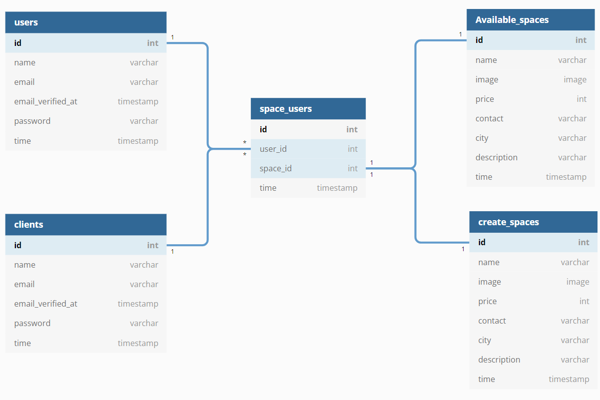
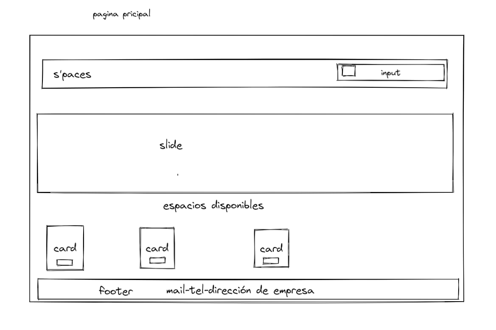
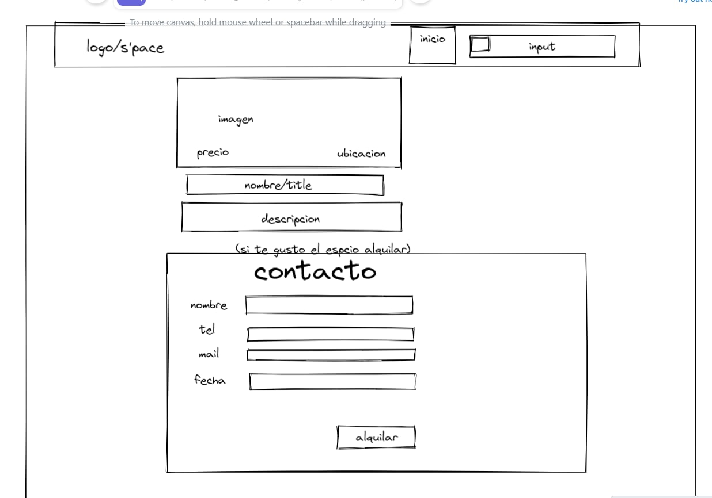

# Marketplace **s-pace**

## A S-PACE FOR CODERS LIKE YOU
___
<br>


- - -
```
¡¡¡ EL ESPACIO IDÓNEO PARA TUS NECESIDADES !!!

Toda la oferta de oficinas en un único espacio 
```
---
**Pre-requisitos**

1. instalar node
2. instalar npm
3. instalar python3
4. instalar python3 pip
<br>

**Instalación:**

ir github y clonar el proyecto:

---
[git clone](https://github.com/Hackaton-F5/s-pace/) <br>    https://github.com/Hackaton-F5/s-pace/
- - -


**Encuentra dos directorios:**

```html
back y frontreact en el directorio del proyecto
se encuentra un README con la descripción de la instalación de react y python flask.
```
Adicionalmente, para despeglar el front hay que instalar las siguientes dependecias:
</br>
* [npm install] axios
* [npm install] @mui/material @emotion/react @emotion/styled
* [npm install] react-router-dom

#
**Pruebas**
# 

Las pruebas son realizadas con la
herrameinta de python, pytest.
Con esta herramienta se verifica la creacion de la base de datos,
y que el sistema se esté ejecutando con los paramatros establecidos
para su correcto funcionamiento en el desplugue que se este realizando.
___

#### **Tecnologías y herramientas del proyecto:**

* Python
* Python flask
* ReactJs
* Bootstrap y MUI
---
**BD**
---



___
[Scrum](https://trello.com/b/Ol7dzpzO/marketplace) 
___
## Wireframe
---





**Desarrolladores:** 
```
* Karen Rosales 
* email: karenvane129@gmail.com
* Mayu Ruiz
* email: aruizrull@protonmail.com
* Noelia Valverde
* email: noelia.valverde@gmail.com
* Ignacio moreno frison 
* email: imoreno.im69@gmail.com
* Valentina Vergara 
* email: valentina.98.3440@gmail.com
* Dario Higuera 
* email: dariohimo@gmail.com
```
___
 #### Patrocinadores hackaton Febrero 2022

 [educamas](https://educamas.com.co/)<br>
- - -
 [factoriaf5](https://simplon.co/)<br>
___
 [adevinta](https://www.adevinta.es/)<br>
___
 ## Downloads
#### GitHub (All Releases)
[]()  

